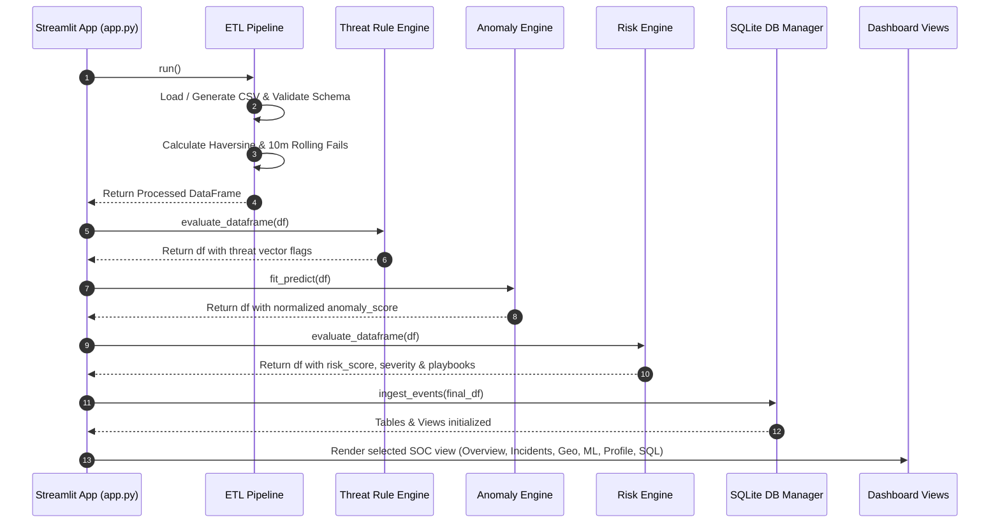

# CyberGuard AI Platform - High-Level Design (HLD)

## 1. Executive System Overview
**CyberGuard** is designed as a modular, 5-tier enterprise cybersecurity analytics architecture that ingests authentication attempt telemetry, processes features in real time, evaluates threat heuristics and machine learning anomaly models, calculates composite risk scores, persists structured data into a relational SQLite database, and exposes threat intelligence through an interactive SOC dashboard and automated PDF reports.

---

## 2. High-Level Architecture Diagram

```
+-------------------------------------------------------------------------------+
|                        1. TELEMETRY INGESTION TIER                            |
|        - Synthetic Authentication Log Generator (generator.py)                |
|        - Data Validator & Schema Inspector (validator.py)                      |
+-------------------------------------------------------------------------------+
                                        |
                                        v
+-------------------------------------------------------------------------------+
|                   2. ETL & FEATURE ENGINEERING TIER                           |
|        - Temporal Deltas & Geographical Haversine Speed (km/h)                |
|        - 10-Minute Rolling Failure Counts (Per User & Per IP)                 |
|        - Distinct User per IP Windowing (pipeline.py)                         |
+-------------------------------------------------------------------------------+
                                        |
                                        v
+-------------------------------------------------------------------------------+
|              3. THREAT DETECTION & ML ANOMALY ENGINE TIER                     |
|    +-------------------------------+   +------------------------------------+ |
|    | Static Threat Rules           |   | ML Anomaly Suite & Benchmarker     | |
|    | - Impossible Travel (>800km/h)|   | - Isolation Forest (Production)    | |
|    | - Brute Force (5+ fails)      |   | - One-Class SVM                    | |
|    | - Credential Stuffing (10+usr)|   | - Local Outlier Factor (LOF)       | |
|    | - Privilege Escalation        |   | - DBSCAN                           | |
|    +-------------------------------+   | - MLP Autoencoder                  | |
|                                        +------------------------------------+ |
+-------------------------------------------------------------------------------+
                                        |
                                        v
+-------------------------------------------------------------------------------+
|               4. COMPOSITE RISK & AI INTELLIGENCE TIER                        |
|        - Dynamic Multi-Factor Risk Engine (0-100 Score & Severity)            |
|        - Confidence Rating Calculation & SOC Action Playbooks                 |
|        - Natural Language AI Security Briefing Generator (insight_engine.py)  |
+-------------------------------------------------------------------------------+
                                        |
                                        v
+-------------------------------------------------------------------------------+
|               5. PERSISTENCE, REPORTING & DASHBOARD TIER                      |
|    +--------------------------------+  +------------------------------------+ |
|    | SQLite DB Storage & Views      |  | Streamlit SOC UI & Exporter        | |
|    | - users, devices, auth_events  |  | - 6 Interactive SOC Views          | |
|    | - v_user_risk_summary View     |  | - Automated PDF & CSV Export       | |
|    | - v_threat_timeline View       |  |   (report_generator.py)            | |
|    +--------------------------------+  +------------------------------------+ |
+-------------------------------------------------------------------------------+
```

---

## 3. System Components & Package Boundaries

The codebase is organized under the `cyberguard` namespace package, structured cleanly into distinct sub-modules:

| Component Package | Class / Core Files | Key Responsibilities |
| :--- | :--- | :--- |
| `cyberguard.config` | `settings.py` | Centralized system constants, paths, thresholds, and ML parameters. |
| `cyberguard.utils` | `logger.py` | Standardized Python logging configuration across modules. |
| `cyberguard.etl` | `generator.py`<br>`validator.py`<br>`pipeline.py` | Telemetry log generation, schema validation, missing data cleaning, Haversine distance, and 10-min rolling aggregations. |
| `cyberguard.analytics` | `threat_rules.py`<br>`profiler.py` | Static rule detection for Impossible Travel, Brute Force, Credential Stuffing, Privilege Escalation, and user baseline profiling. |
| `cyberguard.models` | `anomaly_engine.py`<br>`benchmarker.py` | Production Isolation Forest model fitting, score normalization, and 5-model ML benchmark suite execution. |
| `cyberguard.risk` | `risk_engine.py` | Composite risk scoring (0-100), severity classification, confidence calculation, and SOC action playbook mapping. |
| `cyberguard.ai` | `insight_engine.py` | Natural Language processing and executive threat briefing generation. |
| `cyberguard.sql` | `db_manager.py`<br>`queries.py` | Relational SQLite DDL schema creation, table population, indexing, and window analytics views. |
| `cyberguard.reporting` | `report_generator.py` | ReportLab PDF executive layout engine and CSV data export handler. |
| `cyberguard.dashboard` | `components.py`<br>`views_*.py` | Streamlit dark SOC UI layout, SVG icons, Plotly charts, and multi-page view routing. |

---

## 4. End-to-End Data Integration Flow



---

## 5. Persistence & Database Design Overview

The database uses SQLite3 with foreign key integrity constraints and indexes for high-throughput SOC analytical querying:

- **`users` Table**: Master user registry with role tagging (`Administrator` vs `Standard`) and temporal ranges (`first_seen`, `last_seen`).
- **`devices` Table**: Master device type dictionary.
- **`auth_events` Table**: Fact table containing all authentication logs along with features, threat flags, anomaly scores, and risk ratings.
- **`risk_alerts` Table**: High-priority alert queue filtering incidents with `risk_score >= 70.0`.
- **Analytical Views**:
  - `v_user_risk_summary`: Aggregates login totals, failure counts, failure percentages, max risk scores, and distinct IP/country counts grouped by user.
  - `v_threat_timeline`: Filters high-severity incidents (`risk_score >= 70.0`) sorted chronologically for SOC triage.

---

## 6. Architectural Design Patterns

1. **Pipeline Architecture Pattern**: Sequentially processes data through ETL -> Rules -> ML -> Risk Engine -> Database -> Dashboard.
2. **Hybrid Detection Pattern**: Combines deterministic static threat rules (low false negative rate for known attacks) with unsupervised ML anomaly scoring (detection of novel behavioral zero-day attacks).
3. **Decoupled Business Logic & UI**: All analytical computation occurs inside pure Python packages independent of Streamlit UI components.
4. **View-Driven Presentation Pattern**: Dashboard views (`views_overview`, `views_incidents`, etc.) receive pre-processed DataFrames and render modular UI components.

---

## 7. Non-Functional Requirements & Security Considerations

- **Performance**: End-to-end data processing for 1,500 authentication events executes in under 500 ms.
- **Scalability**: Decoupled SQLite database views and modular pipeline structure enable migration to PostgreSQL / DuckDB or Spark for higher volumes.
- **Data Integrity**: Input schema validation (`DataValidator`) verifies mandatory column presence and data types prior to execution.
- **Security & Privacy**: IP addresses and user agents are sanitized; administrative account targeted attacks are tagged with priority rules.
